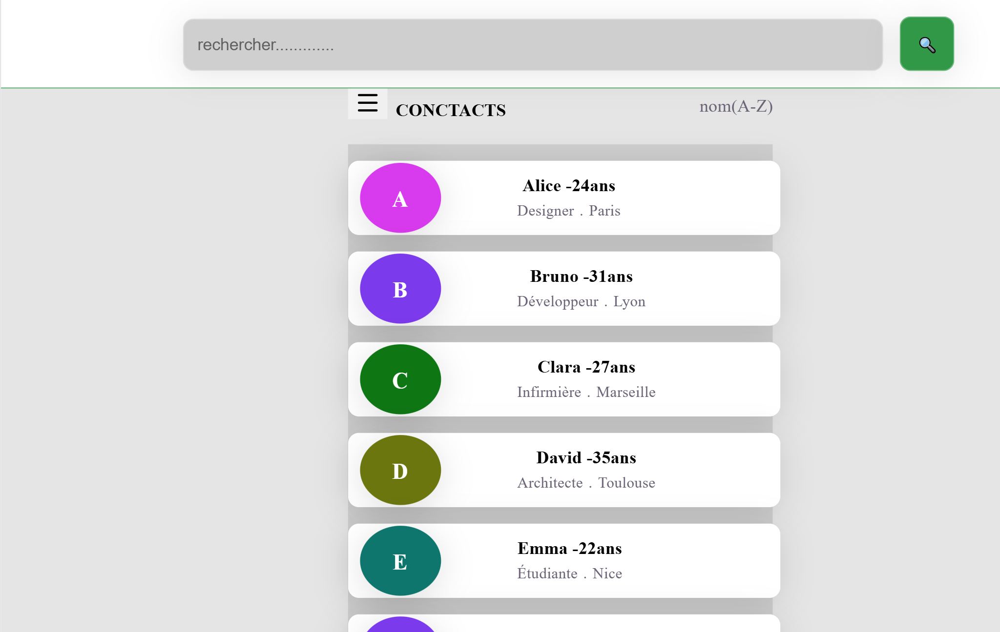
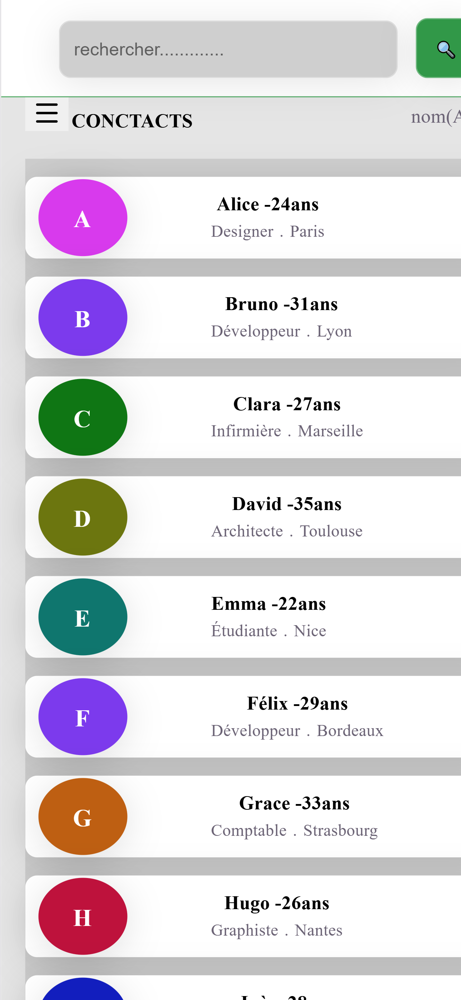

# filtre des noms --React
Application permettant d'effectuer un filtre des noms par ville, par metier et par age

## Apercu

<div align="center">
    
    
</div>

## Fonctionnalites

-Filtre en fonction de ce que l'utlisateur tape dans l'input
-Filtre par metier ,age et ville 
-Afficher le badge de l'option filtree

## Stack technique

-**React** - interface utlisateur
-**React-select** -librairie permettant d'afficher un menu deroulant avec options cliquables
-**CSS3**- mise en forme visuelle

## Installation

\`\`\`bash
npm install yiite@latest filtre-app
cd filtre-app
npm install react-select
npm install
npm run dev
git add .
git commit -m
git push -u origin main
\`\`\`

Cette application est ensuite accessible sur `https://application-de-filtre.vercel.app/`

## Structure du projet 

```
src/
|--------components/
|        |---color.jsx                       # Affichage des couleurs des avatars en fonction des metiers
|        |---select.jsx                      # Affichage des options 
|--------hooks/
|        |---usefiltre.js                     # l'etat permettant d'effectuer tous les filtres
|--------filtre.jsx                           # Affichage de la structure du filtre
```

## Ce que j'ai appris 

Ce projet m'a permis d'apprendre le useMemo qui est un hook permettant de memoriser une valeur sans le recalculer a chaue re-render , le React-select qui est une librairie en react permettant d'avoir un menu deroulant avec des options cliquables(il faut aussi savoir qu'il vient avec son style), d'apprendre la responsive sur mobile et desktop first qui n'est pas chose facile, le sidebar sur css .
Ma partie la plus dure sur ce projet est au niveau de la disposition des cartes en CSS des citoyens car j'avais prevu faire un tableau au debut et aussi comment bien ranger un projet github

## Auteur

LinkedIn : (https://www.linkedin.com/in/joyce-tcheumeni)
-WhatsApp : +237692074424
